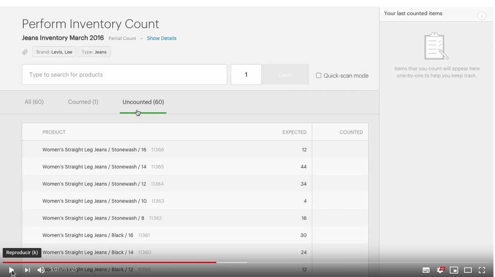

# \<sacs-input-autocomplete\>

Leera los datos que se le proporcionen y filtrara de acuerdo a la busqueda del usuario. Mostrara la opcion para autocompletar al momento que se esta escribiendo una busqueda y regresara en una propiedad los resultados para que puedan ser utilizados.

## Example



## Install the Polymer-CLI

First, make sure you have the [Polymer CLI](https://www.npmjs.com/package/polymer-cli) installed. Then run `polymer serve` to serve your element locally.

## Install component

```
bower i --save sacscloud/sacs-input-autocomplete
```

## Viewing Your Element

```
$ polymer serve
```

## Test of component

The component must have the test basic:

- The component exist
- The component is in the DOM

The component must have test for properties:

- The property exist
- The property is declareded
- The property not is undefined

The component must have test for functions:

- The function is declareded
- The function exist
- The function don't throw error

### Running Tests

```
$ polymer test
```

Your application is already set up to be tested via [web-component-tester](https://github.com/Polymer/web-component-tester). Run `polymer test` to run your application's test suite locally.


## Properties

Name | Type | Description | Default
-----|-------------|---------|--------
`data` | `Array` | Datos que recibe el componente para poder filtrar y mostrar | `[]`
`result` | `Object` | Respuesta del filtrado con item seleccionado  | `{}`


## Methods

Method | Description | Parameters | Return
-----|-------------|---------|------------
`_filterItem` | Se ejecuta al escuchar el evento on-input del input | Objeto de evento | no retorna nada


## Events

Este componente no lanza ningun evento.

## Dependencies

Este componente no usa dependencias de otros componentes

## Use

Se necesita enviarle un set de datos en la propertie `data` para trabajar con ellos

```
<sacs-input-autocomplete api="elestic"></sacs-input-autocomplete>
```

## Behaviour

Descripcion del comportamiento interno del componente.

## Styling

Las siguientes propiedades y mixins estan disponibles para styling.

Custom property | Description | Default
----------------|-------------|----------
`--sacs-table-horizontal-scroll-color` | Color of vertical scroll when the table overflows  | `#36c6d3`
`--sacs-table-horizontal-scroll-hover-color` | Color of hover in vertical scroll when the table overflows | `#0de3f6`
`--sacs-table-first-row-color` | Color of principal rows | `#f2f2f2`
`--sacs-table-second-row-color` | Color of secondary rows | `white`
`--sacs-table-background-head` | Background of table header | `white`

